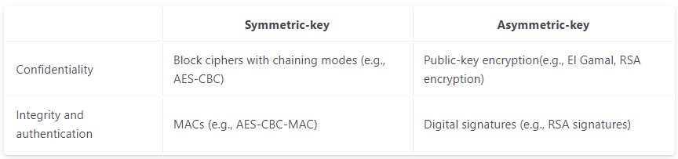

# Just notes

### Definitions:

**Keys:**

- In a symmetric key model, Alice and Bob both know the value of a secret key, and they secure their communications using this shared secret value.
- In an asymmetric key model, each person has a secret key and a corresponding public key.

**Confidentiality, Integrity & Authenticity**

- Confidentiality is the security property preventing adversaries from reading our private data. If a message is confidential, then an attacker does not know its contents. Alice uses a key to lock the message in a box, sends the locked box over the insecure channel to Bob, who then uses the key to unlock the box, enabling him to see the message. So basically Alice encrypts message via key, so from plaintext to ciphertext. Encrypted message goes through insecure channel, Bob receives encrypted message and decrypts it via the key, back into plaintext.

- Integritry is the security property that prevents adversaries from tampering with our private data. If a message has integrity, an attacker is unable to change the content of the message without being detected. 

- Authenticity is the security property that lets us determine who created a given message. If a message has authenticity we can be sure that the message was written by the person claiming to have written it. 

- Authenticity and Integritry are very close to each other. To prove a message is authentic you first have to prove it has not been altered, so they go hand in hand.
Usually an algorithm would work something along the lines of: Alice generates a tag or a signature on a message. She sends the message with the tag to Bob. Bob receives the message and tag, verifies that the tag is valid for the mssage, and if the attacker has modified the message, the tag should no longer be valid, and Bob's verification will fail. An attacker should not be able to generate valid tags for their malicious messages.

- A related property that we might want in a cryptosystem is deniability. If Alice and Bob communicate securely, Alice might want to publish a message from Bob and show it to a judge, claiming that it came from Bob. If the cryptosystem has deniability, there is no cryptographic proof available to guarantee that Alice’s published message came from Bob. For example, consider a case where Alice and Bob use the same key to generate a signature on a message, and Alice publishes a message with a valid signature. Then the judge cannot be sure that the message came from Bob–the signature could have plausibly been created by Alice.

### Overview of schemes

- In symmetric-key encryption, Alice uses her secret key to encrypt a message, and Bob uses the same secret key to decrypt the message.

- In public encryption, Bob generates a matching public key and private key. Hen then shares the public key with Alice, but keeps the private key secret. Alice can encrypt messages under the public key and Bob can decrypt it with his private key. If the scheme is secure, no one apart from Alice and Bob should be able to learn anything aobut the message.

- In the symmetric-key setting, message authentication codes (MACs) provide integrity and authenticity. Alice uses the shared secret key to generate a MAC on her message, and Bob uses the same secret key to verify the MAC. If the MAC is valid, then Bob can be confident that no attacker modified the message, and the message actually came from Alice.

- In the asymmetric-key setting, public-key signatures (also known as digital signatures) provide integrity and authenticity. Alice generates a matching public key and private key, and shares the public key with Bob (but does not share her private key with anyone). Alice computes a digital signature of her message using her private key, and appends the signature to her message. When Bob receives the message and its signature, he will be able to use Alice’s public key to verify that no one has tampered with or modified the message, and that the message actually came from Alice.

### Diffie-Hellman
Alice and Bob establish public parameters **p and g**. **p** is a large prime and **g** is a generator in the range 1 < **g** < **p-1**. So Alice could pick **g** and **p** and announce it publicly to Bob, as they are not a secret. Alice then picks a secret value **a** at random from the set **{0, 1, ..., p - 2}**, and computes $A = g^a \mod p$.  
Bob randomly picks a secret value b in the range **{0, 1, ..., p - 2}** and computes $B = g^b \mod p$.  
Now Alice and Bob announces the values of **A** and **B**, whilst keeping **a** and **b** secret. Alice can use her knowdlege of **B** and **a** to compute:  
$S = B^a = (g^b)^a = g^{ba}\ (mod\ p)$.  
And Bob can symmetrically use his knowledge of **A** and **b** to compute:  
$S = A^b = (g^a)^b = g^{ab}\ (mod\ p)$.  
Should be noted that $g^{ba} = g^{ab}\ (mod\ p)$, so Alice and Bob ends up with the same result, **S**.  
As far as we know, there is not an efficient algorithm to deduce $S = g^{ab}\ mod\ p$, based on the values the attacker sees $A = g^a \mod p,\ B = g^b \mod p,\ g,\ and\ p.$ Why this is hard is closely related to the discrete logarithm problem, as the fastest known algorithm for solving this particular problem is faar to slow for reasonable attacks.
